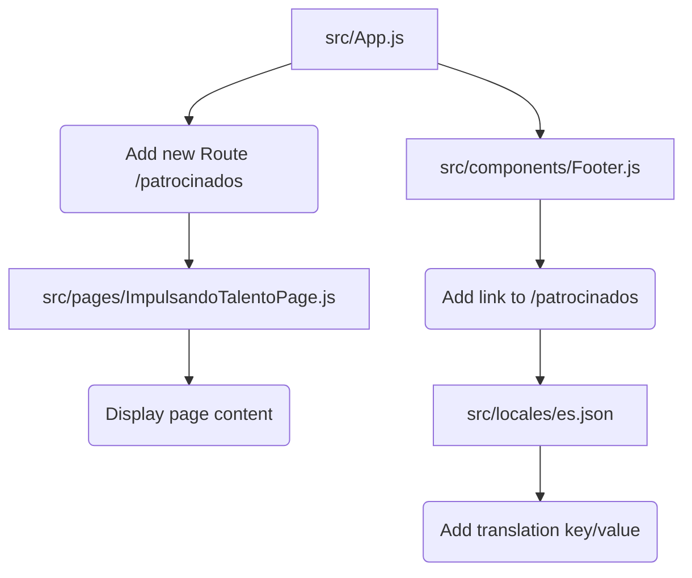

# Plan for Creating "Impulsando el Talento" Page

**Task:** Create a new page for the "Impulsando el Talento" task object with the following details:
- id: 'impulsando-talento'
- title: 'Impulsando el Talento'
- description: 'Apoyamos el automovilismo en eventos como NASCAR México y Nations Panama City 200, colaborando con marcas como Glidden Stores y PPG México.'
- link: '/patrocinados'
- imageUrl: '/sliderhome/portada3.png'

**Analysis:**
- The application uses `react-router-dom` for routing, defined in `src/App.js`.
- There is no existing route for `/patrocinados`.
- The existing `src/components/Sponsors.js` component is basic and likely not suitable for the detailed content required.
- Spanish localization is handled in `src/locales/es.json`.
- The link to the new page should be added to the Footer navigation (`src/components/Footer.js`).

**Proposed Plan:**

1.  **Create the new page component:** A new file, `src/pages/ImpulsandoTalentoPage.js`, will be created. This component will contain the content for the "Impulsando el Talento" page, using the details provided in the task object (title, description, and image).
2.  **Add the route:** A new route will be added to `src/App.js` with the path `/patrocinados` that renders the `ImpulsandoTalentoPage` component.
3.  **Add the link to the Footer:** A new link will be added to the "Enlaces rápidos" section within the `src/components/Footer.js` component. This link will point to `/patrocinados` and have the text "Impulsando el Talento".
4.  **Add localization:** A new translation key and value will be added to `src/locales/es.json` for the "Impulsando el Talento" link text in the footer.

**Diagram:**

**Next Steps:**

Once this plan is approved, I will switch to Code mode to implement these changes.